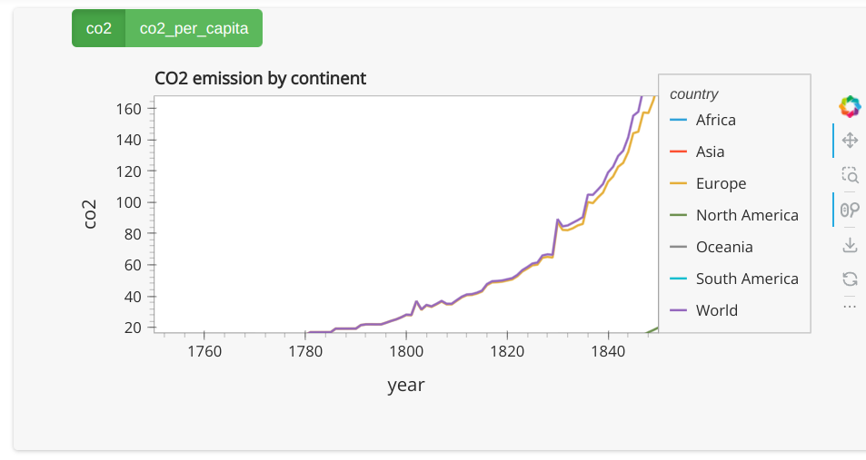
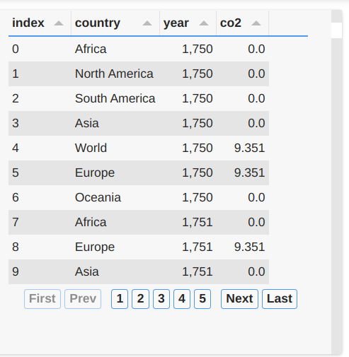
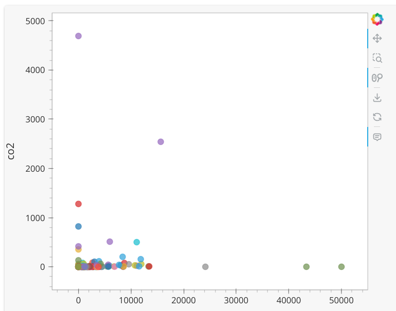
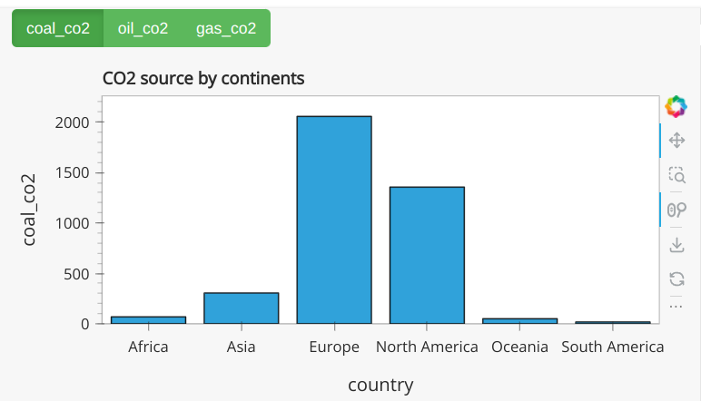

# globalCO2Emission
An interactive data visualization dashboard to analyze and visualize global carbon dioxide (CO2) emissions data using Python "hvplot" library.
Data Source: https://raw.githubusercontent.com/owid/co2-data/master/owid-co2-data.csv

Utilized hvplot to create dynamic and interactive time series plots, enabling users to explore C02 emissions trends over time.

The interactive features included the ability to group data by country, continents and year.
